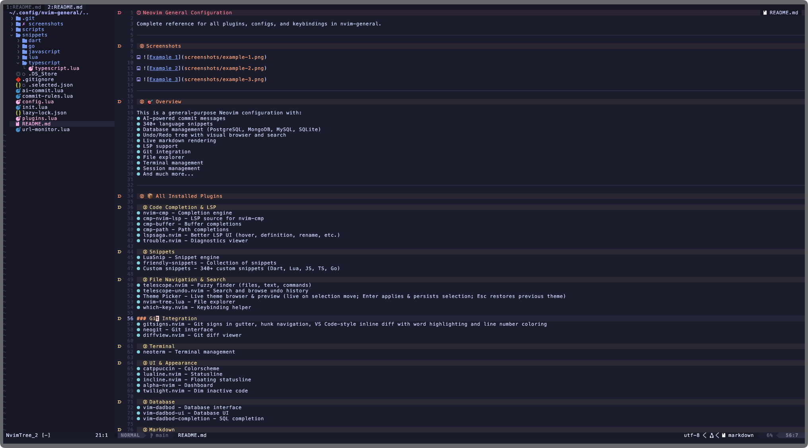
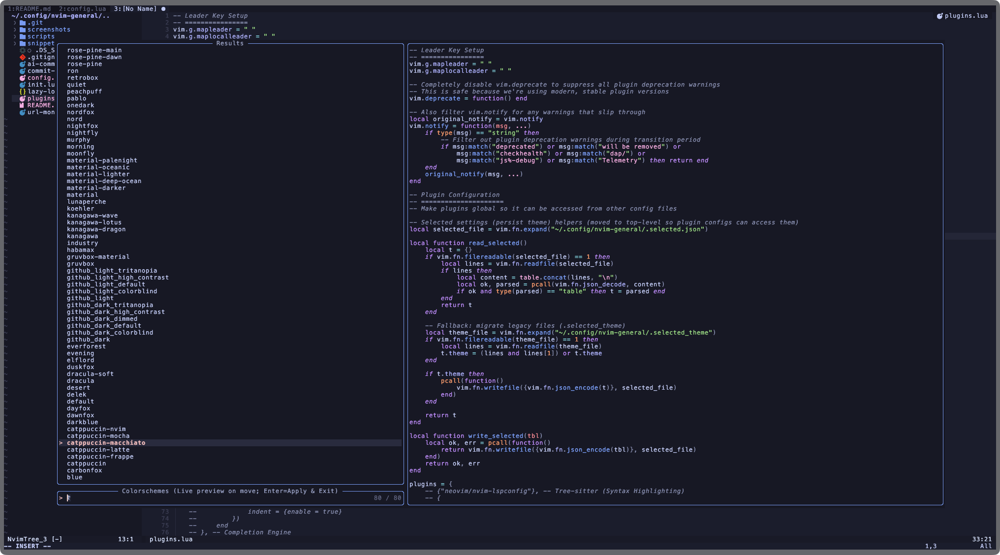
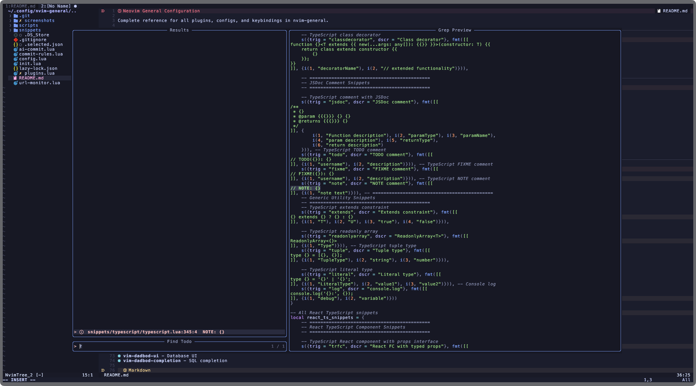

# nvim-general

General-purpose Neovim configuration with AI commit messages, 340+ snippets, database management, LSP, git integration, and more.

## Files

| File | What |
| ---- | ---- |
| `SHORTCUTS.md` | All keymaps and shortcuts |
| `INFO.md` | Plugin list, config, quick start guides, troubleshooting, tips |
| `plugins.lua` | All plugin specs and configs |
| `config.lua` | General settings and keymaps |
| `snippets/` | Custom snippets (Dart, Lua, JS, TS, Go) |

## Screenshots





## Quick start

```
<Space>ff   Find files
<Space>fg   Grep text
<Space>e    File tree
<Space>gg   Git (Neogit)
<Space>cg   AI commit message
<Space>st   Search TODO/FIXME comments
```

Leader key is `<Space>`. See `SHORTCUTS.md` for the full list.
